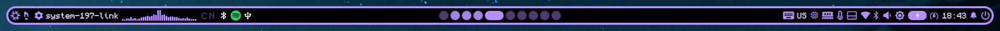

# dimunyx-qs



## Description
dimunyx-qs is a [quickshell](https://quickshell.org)-based bar (NOT A FORK!) \
Originally created for the upcoming dimunyx-shell project. \
This project is inspired by Noctalia V4. \
Since Noctalia V4 is being deprecated and is no longer actively maintained, I decided to create my own Quickshell bar.

## Installation

### Manual

#### Wallpapers
To install wallpapers you need to clone [wall-archive](https://github.com/vimlinuz/wall-archive) into `$HOME/.config/wallpapers` \
Also if you have your own wallpaper(s) you can put them into `$HOME/.config/wallpapers`

#### Dependencies

- bash
- awk
- grep
- sed
- tr
- df
- find
- niri (или hyprctl для Hyprland)
- brightnessctl
- playerctl
- cliphist
- wl-clipboard
- cava
- lm_sensors
- power-profiles-daemon
- bluez
- [wall-archive](https://github.com/vimlinuz/wall-archive)
- quickshell

#### deps-check.sh dependencies
- dialog
- newt
- less \

Install all dependencies and move All files into `$HOME/.config/quickshell` then run `qs -d`

### Arch (in development)

### NixOS

#### Flake input
```nix
{
    inputs.dimunyx-qs.url = "github:dimunyx-shell/dimunyx-qs";
    outputs = { inputs, ... };
}
```

#### Home Manager
```nix
{
    { pkgs, lib, inputs, ... }: {
        imports = [
            inputs.dimunyx-qs.homeManagerModules.x86_64-linux.default
        ];
        programs.dimunyx-qs.enable = true;
    };
}
```

#### Configuring

#### Settings
Settings are now under development and will not be added in the past feature

##### Options
```nix
programs.dimunyx-qs.enable = true/false; (enable dimunyx-qs)
programs.dimunyx-qs.enableWallpapers = true/false; (enable dimunyx-qs wallpapers feature)
programs.dimunyx-qs.weather.enable = true/false; (enable OpenWeatherMap feature for dimunyx-qs)
programs.dimunyx-qs.weather.key = ""; (OpenWeatherMap API Key for weather)
programs.dimunyx-qs.password = ""; (Lockscreen password)
programs.dimunyx-qs.locale = ""; (Change dimunyx-qs default locale)
```

##### Locale
Available languages: `en_US`, `ru_RU`, `ro_RO`

##### IPC
```
dimunyx-qs
├─media
│ ├─play
│ ├─pause
│ ├─playPause
│ ├─next
│ └─previous
│
├─volume
│ ├─volUp
│ ├─volDown
│ ├─volMute
│ └─micMute
│
├─notifications
│  ├─toggle
│  └─dnd
│
├─session
│ ├─toggle
│ ├─suspend
│ ├─reboot
│ ├─lock
│ └─poweroff
│
├─brightness
│ ├─brightUp
│ └─brightDown
│
└─appLauncher
  ├─cmd
  ├─apps
  ├─clip
  ├─windows
  └─clipClear
```


